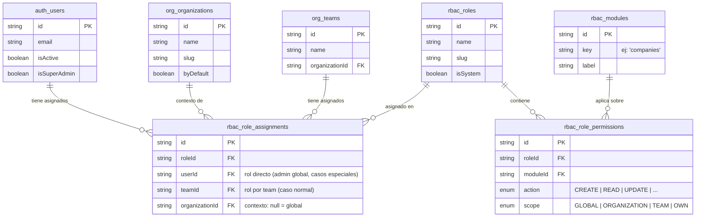
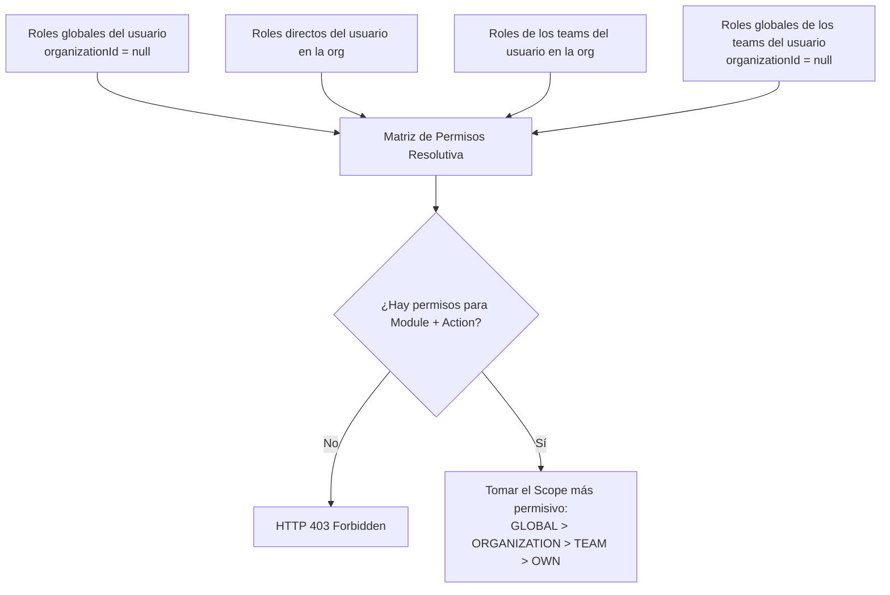
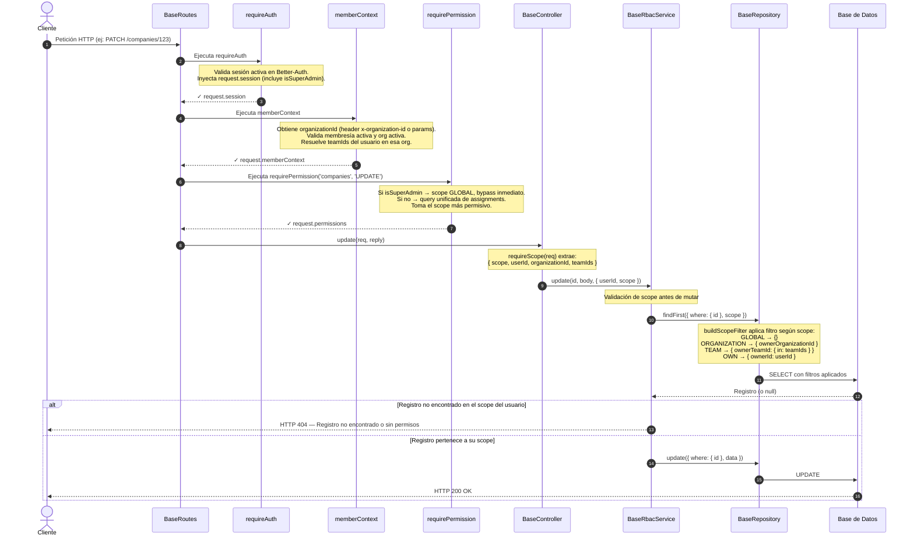

# Guía del Sistema de Roles y Permisos (RBAC)

Este documento detalla conceptual y técnicamente el funcionamiento del sistema de **Control de Acceso Basado en Roles (RBAC)** implementado en la aplicación.

---

## 1. Conceptos Fundamentales

El sistema de permisos está diseñado en torno al concepto de **recursos multi-inquilino (multi-tenant)**, donde la **organización** actúa como separador de datos y los **teams** como agrupadores de permisos.

### Principios de Diseño

- **Organización** → separador de datos (tenant). No tiene roles asignados ni ownership propio.
- **Team** → agrupador de permisos dentro de una organización. Los roles se asignan a teams, no a usuarios individuales (salvo excepciones como roles globales de sistema).
- **Usuario** → pertenece a uno o varios teams. Hereda los roles de sus teams.
- **Superadmin** → campo `isSuperAdmin` en `User`. Bypass total del pipeline RBAC, scope `GLOBAL` implícito sobre todos los datos del sistema.

### Entidades del Modelo



### Elementos Clave del Control de Acceso

**Recurso (`Module`)**: La sección o entidad del sistema sobre la que se quiere actuar (ej: `companies`, `teams`, `invoices`). Se registran en seed y son la fuente de verdad de la matriz de permisos.

**Acción (`PermissionAction`)**: Qué se quiere hacer sobre el recurso:

| Acción     | Descripción                        |
| ---------- | ---------------------------------- |
| `CREATE`   | Crear nuevos registros             |
| `READ`     | Visualizar o listar registros      |
| `UPDATE`   | Modificar registros existentes     |
| `DELETE`   | Eliminar (lógicamente) registros   |
| `RESTORE`  | Recuperar registros de la papelera |
| `EXPORT`   | Exportar datos                     |
| `IMPORT`   | Importar datos                     |
| `SETTINGS` | Acceder a configuración            |

**Ámbito (`PermissionScope`)**: Sobre qué registros aplica la acción. Orden de precedencia de mayor a menor permisividad:

| Scope             | Descripción                         | Filtro aplicado               |
| ----------------- | ----------------------------------- | ----------------------------- |
| 👑 `GLOBAL`       | Todos los registros del sistema     | `{}` (sin filtro)             |
| 🏢 `ORGANIZATION` | Registros de la organización activa | `ownerOrganizationId = orgId` |
| 👥 `TEAM`         | Registros de los teams del usuario  | `ownerTeamId IN [teamIds]`    |
| 👤 `OWN`          | Solo registros propios del usuario  | `ownerId = userId`            |

---

## 2. Jerarquía de Servicios

El sistema está estructurado en tres niveles de herencia que se corresponden con las necesidades de cada tipo de entidad:

```
BaseCrudService       → CRUD puro, sin userId ni scope
    └── BaseAuditService  → + auditoría (createdBy, deletedAt, softDelete, restore)
            └── BaseRbacService   → + scope/ownership RBAC
```

| Entidad                           | Servicio base      | Ownership en schema |
| --------------------------------- | ------------------ | ------------------- |
| `Module`, tokens de verificación  | `BaseCrudService`  | ❌ no aplica        |
| `Organization`, `Role`, `Team`    | `BaseAuditService` | ❌ eliminado        |
| `Company`, `Invoice`, `Lead`, ... | `BaseRbacService`  | ✅ mantener         |

### `WriteOptions` — tipo compartido

Todas las firmas de escritura usan un único tipo para evitar incompatibilidades en los overrides:

```typescript
export type WriteOptions = {
  userId?: string;
  scope?: ScopeContext;
  include?: any;
  select?: any;
};
```

---

## 3. Asignación de Roles

### Caso normal — rol por team

El flujo recomendado para gestionar permisos en apps pequeñas y medianas:

```
Org: "Mi Empresa"
  Team: "Admins"    → Rol: org-admin   (GLOBAL en todos los módulos de la org)
  Team: "Ventas"    → Rol: vendedor    (CREATE/READ/UPDATE en companies, deals)
  Team: "Soporte"   → Rol: soporte     (READ en todo, scope OWN)

Usuario "María" → miembro de "Ventas"
  → hereda automáticamente el rol "vendedor"
  → cambiar su team cambia sus permisos instantáneamente
```

### Caso especial — rol directo a usuario

Solo para casos excepcionales como invitados con acceso puntual:

```typescript
// organizationId = null → rol global (aplica en cualquier org)
// organizationId = <id> → rol restringido a esa organización
await prisma.roleAssignment.create({
  data: {
    roleId: guestRoleId,
    userId: userId,
    organizationId: orgId,
    assignedBy: adminId,
  },
});
```

### Roles de sistema (seed)

Los roles de sistema se crean en seed con `isSystem: true` y no pueden eliminarse desde la UI:

```typescript
const systemRoles = [
  {
    slug: 'org-admin',
    name: 'Admin de organización',
    isSystem: true,
    // Todos los módulos, scope ORGANIZATION
  },
  {
    slug: 'member',
    name: 'Miembro',
    isSystem: true,
    // READ en todo, scope OWN
  },
];
```

Al crear una organización se genera automáticamente un team "Admins" con el rol `org-admin` asignado, y el creador es añadido a ese team.

---

## 4. Herencia de Permisos en Runtime



La query que resuelve todos los assignments en una sola llamada:

```typescript
const assignments = await prisma.roleAssignment.findMany({
  where: {
    OR: [
      { userId, organizationId }, // rol directo en esta org
      { userId, organizationId: null }, // rol global directo
      { teamId: { in: teamIds }, organizationId }, // rol por team en esta org
      { teamId: { in: teamIds }, organizationId: null }, // rol global por team
    ],
  },
  include: {
    role: {
      include: {
        permissions: {
          where: { module: { key: resource }, action },
        },
      },
    },
  },
});
```

---

## 5. Flujo Técnico de una Petición (Pipeline)



---

## 6. Superadmin

El superadmin es un campo en `User` (`isSuperAdmin: boolean`), no un rol del sistema RBAC. Se asigna directamente en base de datos mediante script y nunca desde la UI.

```typescript
// scripts/make-superadmin.ts
await prisma.user.update({
  where: { email: 'admin@empresa.com' },
  data: { isSuperAdmin: true },
});
```

**Comportamiento:**

- Bypass total del pipeline de permisos — ni consulta la BD de roles.
- Scope `GLOBAL` implícito — ve todos los registros de todas las organizaciones sin filtro.
- No necesita `memberContext` para operar.
- Para revocar acceso urgente: invalidar sesiones manualmente.

```typescript
// Revocar sesiones activas
await prisma.session.updateMany({
  where: { userId },
  data: { isValid: false },
});
```

---

## 7. Implementación — Extractos Clave

### `buildPreHandler` — pipeline configurable por ruta

```typescript
function buildPreHandler(resource: string, action: PermissionAction, options: BaseRoutesOptions) {
  const handlers: any[] = [requireAuth];

  if (!options.auth?.skipMemberContext) handlers.push(memberContext);
  if (!options.auth?.skipPermissions) handlers.push(requirePermission(resource, action));

  return handlers;
}
```

Uso en rutas de sistema (sin contexto de org ni permisos):

```typescript
registerBaseRoutes(fastify, modulesController, {
  resource: 'modules',
  tags: ['Modules'],
  schemas: modulesSchemas,
  auth: { skipMemberContext: true, skipPermissions: true },
});
```

### `buildScopeFilter` — filtros dinámicos en repositorio

```typescript
export function buildScopeFilter(ctx: ScopeContext): Record<string, any> {
  switch (ctx.scope) {
    case 'GLOBAL':
      return {};
    case 'ORGANIZATION':
      return { ownerOrganizationId: ctx.organizationId };
    case 'TEAM':
      return { ownerTeamId: { in: ctx.teamIds } };
    case 'OWN':
      return { ownerId: ctx.userId };
  }
}
```

### `BaseRbacService.update` — verificación de scope antes de mutar

```typescript
override async update(id: string, data: any, options: WriteOptions = {}): Promise<T> {
  // Verifica que el registro existe Y pertenece al scope del usuario
  const record = await this.repository.findFirst({
    where: { id, ...this.getStatusFilter(false) },
    scope: options.scope,
  });
  if (!record) throw new HttpError(404, 'Registro no encontrado o sin permisos');

  // Delega la actualización con auditoría al nivel superior
  return super.update(id, data, options);
}
```

---

## 8. Patrón para Nuevas Entidades de Negocio

Para añadir un nuevo módulo (ej: `Invoice`) al sistema:

**1. Schema Prisma** — copiar el patrón de `Company`: auditoría completa + `ownerId`, `ownerTeamId`, `ownerOrganizationId`.

**2. Módulo en seed** — registrar la key en `rbac_modules`:

```typescript
{ key: 'invoices', label: 'Facturas', isConfigurableByOrg: true }
```

**3. Servicio** — extender `BaseRbacService`:

```typescript
export class InvoicesService extends BaseRbacService<Invoice> {
  protected getStatusFilter(isTrash: boolean) {
    return isTrash
      ? { status: 'TRASHED', deletedAt: { not: null } }
      : { status: { not: 'TRASHED' }, deletedAt: null };
  }

  protected override getDefaultInclude() {
    return {
      owner: { select: { name: true, email: true } },
      ownerOrganization: { select: { id: true, name: true } },
    };
  }
}
```

**4. Rutas** — registrar con `registerBaseRoutes`:

```typescript
registerBaseRoutes(fastify, fastify.invoicesController, {
  resource: 'invoices',
  tags: ['Invoices'],
  schemas: invoicesSchemas,
});
```

El pipeline de seguridad se inyecta automáticamente.
