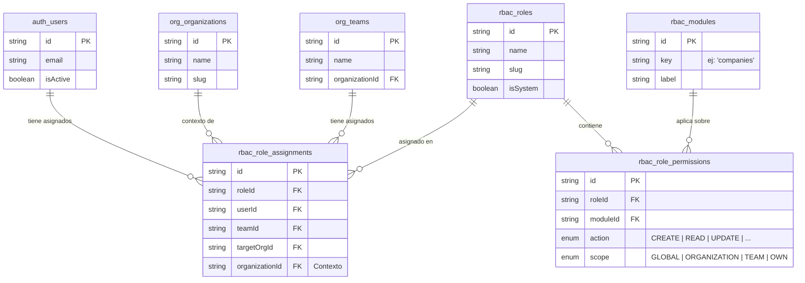
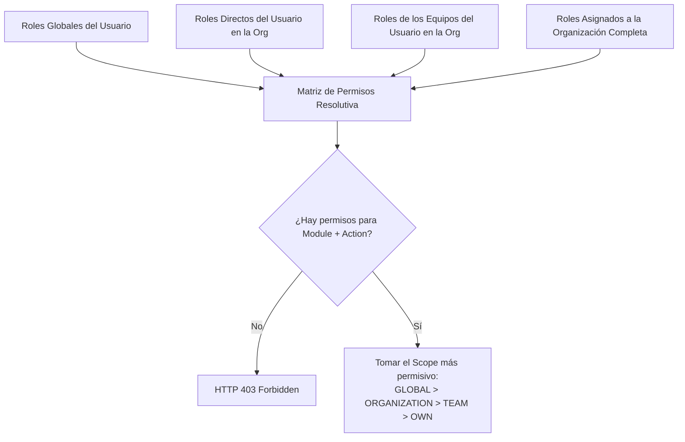
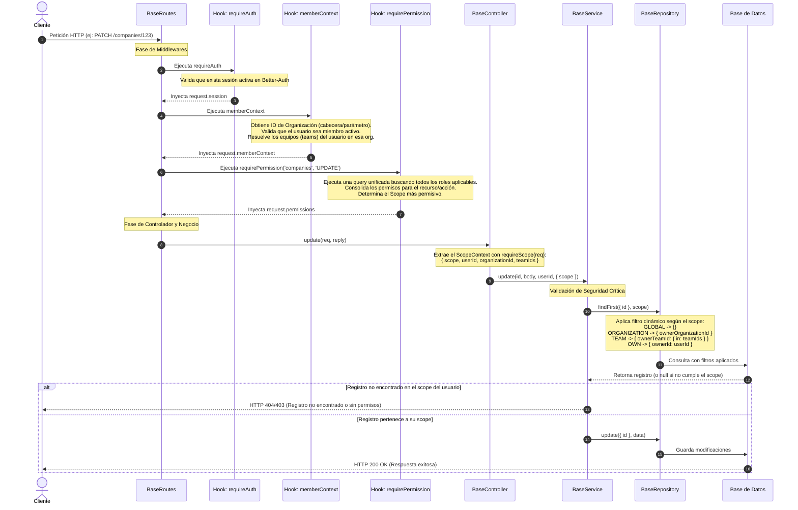

# Guía del Sistema de Roles y Permisos (RBAC)

Este documento detalla conceptual y técnicamente el funcionamiento del sistema de **Control de Acceso Basado en Roles (RBAC)** implementado en la aplicación.

---

## 1. Conceptos Fundamentales

El sistema de permisos está diseñado en torno al concepto de **recursos multi-inquilino (multi-tenant)**, donde la propiedad de cada registro define quién puede interactuar con él en función de su nivel de acceso.

### Entidades del Modelo



### Elementos Clave del Control de Acceso

1. **Recurso (`Module`)**: La sección o entidad del sistema sobre la que se quiere actuar (ej: `companies`, `teams`, `invoices`).
2. **Acción (`PermissionAction`)**: Qué se quiere hacer sobre el recurso. Las acciones estándar son:
   * `CREATE`: Crear nuevos registros.
   * `READ`: Visualizar o listar registros.
   * `UPDATE`: Modificar registros existentes.
   * `DELETE`: Eliminar (física o lógicamente) registros.
   * `RESTORE`: Recuperar registros de la papelera.
3. **Ámbito (`PermissionScope`)**: **Sobre qué registros** tiene permiso el usuario para realizar la acción. El sistema soporta cuatro ámbitos ordenados por nivel de permisividad:
   * 👑 **`GLOBAL`**: Permite actuar sobre **todos** los registros del sistema.
   * 🏢 **`ORGANIZATION`**: Permite actuar sobre registros pertenecientes a la **organización activa** (`ownerOrganizationId`).
   * 👥 **`TEAM`**: Permite actuar sobre registros asignados a los **equipos a los que pertenece el usuario** (`ownerTeamId`).
   * 👤 **`OWN`**: Permite actuar únicamente sobre registros **creados o poseídos directamente por el usuario** (`ownerId`).

---

## 2. Herencia de Permisos en Runtime

Cuando un usuario realiza una petición, el sistema no solo evalúa los roles asignados directamente a su cuenta. En su lugar, resuelve una jerarquía completa basada en su contexto organizativo:



---

## 3. Flujo Técnico de una Petición (Pipeline)

El control de acceso se ejecuta de manera transparente y progresiva mediante middlewares (hooks de Fastify) y lógica encapsulada en las clases base.

### Diagrama de Secuencia Completo



---

## 4. Detalle de Código e Implementación

### Definición de Rutas Automática (`registerBaseRoutes`)
Al declarar las rutas base de cualquier módulo, se inyecta automáticamente el pipeline de seguridad mapeando el recurso y la acción. Ejemplo:

```typescript
// src/modules/companies/companies.routes.ts
registerBaseRoutes(fastify, fastify.companiesController, {
  resource: 'companies', // Identificador del módulo en la BD
  tags: ['Companies'],
  schemas: { ... }
});
```

En la infraestructura base, esto se asocia a las pre-condiciones:
```typescript
// src/routes/base.routes.ts
app.patch(
  '/:id',
  {
    preHandler: [
      requireAuth,
      memberContext,
      requirePermission(options.resource, PermissionAction.UPDATE),
    ],
  },
  (req, reply) => controller.update(req as any, reply)
);
```

### Extracción del Ámbito en Controladores
Cada método del controlador extrae el contexto de seguridad para delegarlo a la capa de negocio:

```typescript
// src/controllers/base.controller.ts
async update(request: FastifyRequest<{ Params: { id: string } }>, reply: FastifyReply) {
  const { id } = request.params;
  const userId = request.session?.user?.id;
  const scope = requireScope(request); // Extrae scope, userId, orgId, teamIds

  const record = await this.service.update(id, request.body, userId, { scope });
  return reply.send(record);
}
```

### Chequeo Previo de Seguridad en Servicios
Para prevenir escaladas de privilegios en operaciones individuales mediante IDs aleatorios u obtenidos maliciosamente, el servicio valida la propiedad de manera proactiva:

```typescript
// src/services/base.service.ts
async update(id: string, data: any, userId?: string, options: { scope?: ScopeContext }): Promise<T> {
  const where = { id, ...this.getStatusFilter(false) };
  
  // Realiza la búsqueda aplicando estrictamente los filtros del scope resuelto
  const record = await this.repository.findFirst({ where, scope: options.scope });
  if (!record) {
    throw new HttpError(404, 'Registro no encontrado o sin permisos');
  }

  // Si existe en su scope, procede con la actualización real de forma segura
  return await this.repository.update({
    where: { id },
    data: { ...data, ...withUpdatedBy(userId) },
  });
}
```

### Inyección de Filtros en Repositorios
La capa de base de datos se encarga de traducir el ámbito resuelto en filtros nativos de Prisma:

```typescript
// src/repositories/base.repository.ts
export function buildScopeFilter(ctx: ScopeContext): Record<string, any> {
  switch (ctx.scope) {
    case 'GLOBAL':
      return {};
    case 'ORGANIZATION':
      return { ownerOrganizationId: ctx.organizationId };
    case 'TEAM':
      return { ownerTeamId: { in: ctx.teamIds } };
    case 'OWN':
      return { ownerId: ctx.userId };
  }
}
```
