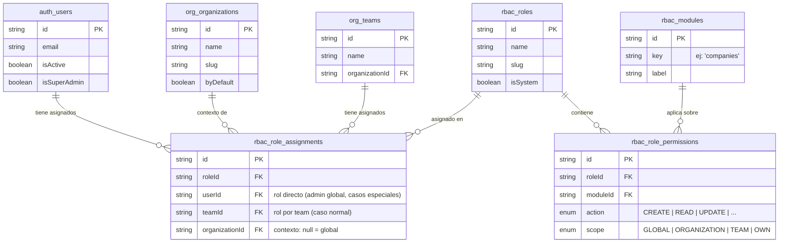
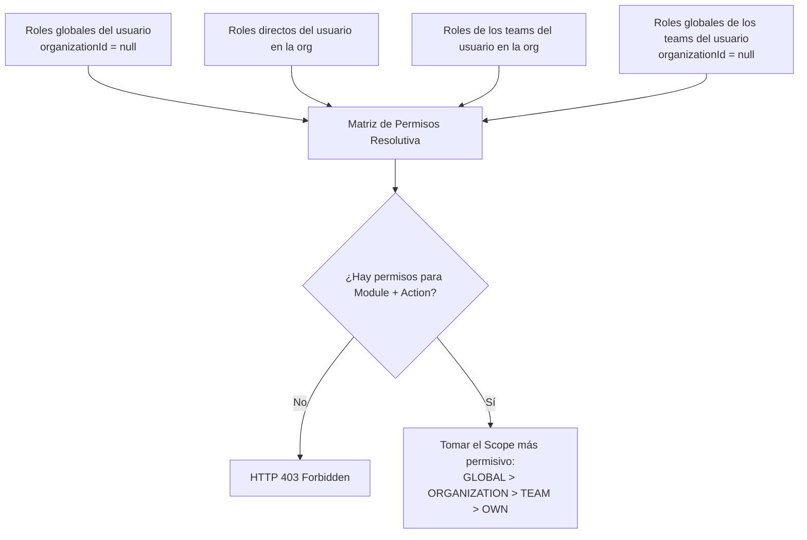
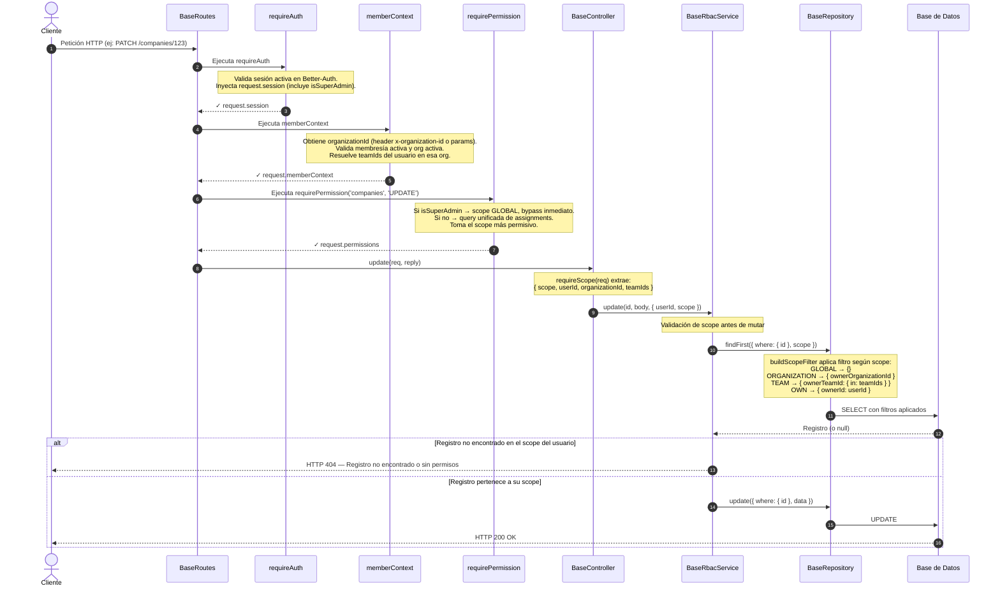

# Guía del Sistema de Roles y Permisos (RBAC)

Este documento detalla el funcionamiento conceptual y operativo del sistema de **Control de Acceso Basado en Roles (RBAC)** implementado en la aplicación. Su objetivo es servir de referencia tanto para el equipo técnico como para los responsables funcionales de negocio.

---

## 1. Conceptos Fundamentales

El sistema de permisos está diseñado bajo un modelo **multi-inquilino (multi-tenant)** flexible, donde los usuarios pueden colaborar en diferentes entornos sin mezclar la información.

### Principios de Diseño

- **Organización**: Actúa como un contenedor y separador estricto de datos (tenant). Los datos de una organización son invisibles para otra.
- **Multi-organización**: **Un usuario puede pertenecer a varias organizaciones** simultáneamente. Al crear datos se le asignará la organización principal del usuario.
- **Team (Equipo)**: Es un agrupador de permisos dentro de una organización concreta. Los roles y capacidades no se asignan directamente a las personas, sino a los equipos.
- **Usuario**: Pertenece a uno o varios equipos dentro de cada organización. El usuario hereda de forma automática todos los permisos y roles de los equipos a los que pertenece en la organización que tiene activa.
- **Superadmin**: Es un atributo especial de usuario que otorga un acceso global e irrestricto. Ignora cualquier validación de roles y puede ver o modificar los datos de absolutamente todas las organizaciones del sistema.

### Entidades del Modelo

A nivel de estructura de datos, el sistema relaciona a los usuarios con las organizaciones y equipos mediante la siguiente arquitectura:

### Elementos Clave del Control de Acceso

Para determinar si un usuario puede realizar una acción, el sistema evalúa tres componentes:

**1. Recurso (`Module`)**
La sección o entidad del sistema sobre la que se quiere actuar (por ejemplo: Empresas, Equipos, Facturas).

**2. Acción (`PermissionAction`)**
La operación específica que se desea ejecutar sobre el recurso:

| Acción     | Descripción Funcional                                                             |
| :--------- | :-------------------------------------------------------------------------------- |
| `CREATE`   | Crear nuevos registros o elementos.                                               |
| `READ`     | Visualizar, listar o consultar la información.                                    |
| `UPDATE`   | Modificar o editar elementos existentes.                                          |
| `DELETE`   | Eliminar elementos (habitualmente mediante borrado lógico o envío a la papelera). |
| `RESTORE`  | Recuperar elementos que estaban en la papelera.                                   |
| `EXPORT`   | Descargar o exportar los datos del módulo.                                        |
| `IMPORT`   | Subir o cargar masivamente datos al módulo.                                       |
| `SETTINGS` | Acceder a la configuración específica del módulo.                                 |

**3. Ámbito (`PermissionScope`)**
Define a qué registros específicos tiene alcance el usuario según su nivel de confianza o responsabilidad. Ordenados de mayor a menor apertura:

| Ámbito            | Descripción                     | Criterio de Acceso                                                                         |
| :---------------- | :------------------------------ | :----------------------------------------------------------------------------------------- |
| 👑 `GLOBAL`       | Acceso a todo el sistema.       | Sin restricciones (reservado a superadmins o roles del sistema globales).                  |
| 🏢 `ORGANIZATION` | Acceso a nivel de organización. | Solo ve registros creados dentro de la organización activa del usuario.                    |
| 👥 `TEAM`         | Acceso a nivel de equipo.       | Solo ve registros compartidos o asignados a los equipos a los que pertenece el usuario.    |
| 👤 `OWN`          | Acceso estrictamente personal.  | Solo ve los registros que el propio usuario ha creado o de los que es propietario directo. |

---

## 2. Jerarquía de Servicios y Datos

Para simplificar el desarrollo y asegurar que las reglas de negocio se cumplan siempre, las entidades del sistema se dividen en tres categorías según su nivel de control:

1.  **Operaciones Básicas**: Elementos técnicos (como los nombres de los módulos del sistema) que no pertenecen a ninguna organización ni usuario.
2.  **Operaciones con Auditoría**: Elementos estructurales de la plataforma (Organizaciones, Roles, Equipos). El sistema registra quién los creó y cuándo, pero no se rigen por la propiedad de un usuario individual.
3.  **Operaciones de Negocio Protegidas**: Son las entidades críticas de la aplicación (Empresas, Facturas, Oportunidades). Todos estos registros guardan obligatoriamente información sobre **qué usuario lo creó, a qué equipo pertenece y a qué organización corresponde**, permitiendo aplicar los filtros de ámbito de forma automática.

---

## 3. Asignación y Flujo de Roles

### Gestión por Equipos (Caso Habitual)

Es la práctica recomendada para administrar los accesos en el día a día. Permite agrupar las capacidades por funciones laborales:

- **Organización Activa**: "Empresa S.A."
  - **Equipo "Administradores"** $
ightarrow$ Asignado el Rol: _Administrador de Org_ (Ámbito `ORGANIZATION` completo).
  - **Equipo "Ventas"** $
ightarrow$ Asignado el Rol: _Vendedor_ (Acciones de lectura, creación y edición en Empresas y Clientes).
  - **Equipo "Soporte"** $
ightarrow$ Asignado el Rol: \*Técnico de Soporte\* (Solo lectura de datos en ámbito `OWN`).

Si la usuaria **"María"** es miembro del equipo de "Ventas", heredará de inmediato los permisos de ese grupo. Si mañana cambia al equipo de "Administradores", sus capacidades en la aplicación se actualizarán instantáneamente sin necesidad de alterar su ficha de usuario.

### Roles Directos y de Sistema

- **Casos Especiales**: El sistema permite, de forma excepcional, asignar un rol directamente a un usuario (por ejemplo, para auditores externos o consultores invitados de forma temporal).
- **Roles de Sistema**: Existen roles predefinidos que vienen de fábrica (como _Miembro_ o _Admin de Organización_) que garantizan el funcionamiento inicial de la plataforma y no pueden ser eliminados por los usuarios desde la interfaz de usuario. Al registrar una nueva organización, se crea automáticamente el equipo "Admins" y se vincula a su creador.

---

## 4. Herencia de Permisos en Runtime

Cuando un usuario interactúa con la aplicación en una organización concreta, el sistema recopila en tiempo real todas las fuentes de permisos posibles para construir su **matriz resolutiva**.

Si el usuario cuenta con permisos contradictorios o superpuestos para un mismo módulo a través de diferentes equipos, **el sistema siempre aplicará el criterio más generoso o permisivo** (por ejemplo, si un equipo le permite ver solo lo suyo (`OWN`) y otro equipo le permite ver lo de toda la organización (`ORGANIZATION`), prevalecerá el acceso a toda la organización).

---

## 5. Flujo Funcional y Técnico de una Petición (Pipeline)

Cada vez que cualquier usuario realiza una acción en la aplicación (como ver el detalle de una empresa o modificar una factura), la solicitud atraviesa una serie de aduanas de seguridad antes de consultar o alterar la base de datos:

**Resumen del ciclo:**

1.  **Identificación**: El sistema confirma quién es el usuario y si su sesión es válida.
2.  **Contexto**: Se identifica en qué organización está operando el usuario en ese instante y a qué equipos pertenece dentro de ella.
3.  **Autorización**: Se comprueba si sus roles acumulados cubren la acción solicitada.
4.  **Filtrado Semántico**: Al consultar la base de datos, se le añade un "filtro invisible" a la búsqueda para asegurar que, por ejemplo, si su ámbito es de equipo, la base de datos solo retorne los registros de su equipo. Si un usuario intenta forzar la URL de un registro que no entra en su ámbito, el sistema devolverá un error informando que el elemento no existe o no tiene permisos.

---

## 6. Superadministración y Seguridad Extrema

La figura del Superadmin está pensada exclusivamente para tareas de mantenimiento técnico, soporte avanzado o auditoría global del sistema.

- **Activación Segura**: No se puede promover a nadie a Superadmin desde la pantalla de la aplicación para evitar accidentes o ataques informáticos. Se realiza únicamente mediante comandos directos en el servidor.
- **Bypass Defensivo**: Al activarse, el sistema evita realizar consultas de roles redundantes, permitiendo una velocidad de respuesta óptima para perfiles de administración global.
- **Revocación de Emergencia**: Si las credenciales de un administrador se ven comprometidas, el sistema cuenta con un protocolo de invalidación inmediata que fuerza el cierre de todas sus sesiones activas en cualquier dispositivo de forma fulminante.

---

## 7. Flujo de Trabajo para Incorporar Nuevas Funcionalidades

Cuando el equipo de producto decide añadir un nuevo módulo a la aplicación (por ejemplo: _Contratos_), se debe seguir un sencillo procedimiento estándar:

1.  **Estructura de Datos**: Se diseña la nueva tabla asegurando que incluya los campos obligatorios de propiedad (Usuario creador, Equipo propietario y Organización dueña).
2.  **Registro de Sistema**: Se da de alta el nombre del nuevo módulo en la lista maestra de recursos del sistema para que aparezca disponible en la matriz de permisos.
3.  **Habilitación en Rutas**: Se conecta la nueva sección a los componentes automáticos de seguridad. A partir de ese momento, cualquier pantalla o acción nueva que se intente realizar sobre el módulo heredará, sin añadir código extra, todas las protecciones de ámbitos (`GLOBAL`, `ORGANIZATION`, `TEAM`, `OWN`) descritas en este documento.

## 8. Matrices inciales y ejemplo de roles

### 1. Matriz de Admins

Los administradores mantienen el control absoluto, teniendo acceso completo de lectura, escritura, auditoría y configuración sobre todos los componentes del sistema y del negocio.

#### Tablas de Sistema (Estructurales)

| Módulo            | READ | CREATE | UPDATE | DELETE | RESTORE | EXPORT | IMPORT | SETTINGS |
| :---------------- | :--: | :----: | :----: | :----: | :-----: | :----: | :----: | :------: |
| **users**         |  ✔   |   ✔    |   ✔    |   ✔    |    ✔    |   ✔    |   ✔    |    ✔     |
| **organizations** |  ✔   |   ✔    |   ✔    |   ✔    |    ✔    |   ✔    |   ✔    |    ✔     |
| **teams**         |  ✔   |   ✔    |   ✔    |   ✔    |    ✔    |   ✔    |   ✔    |    ✔     |
| **roles**         |  ✔   |   ✔    |   ✔    |   ✔    |    ✔    |   ✔    |   ✔    |    ✔     |
| **settings**      |  ✔   |   ✔    |   ✔    |   ✔    |    ✔    |   ✔    |   ✔    |    ✔     |
| **audit**         |  ✔   |   ✔    |   ✔    |   ✔    |    ✔    |   ✔    |   ✔    |    ✔     |

#### Tablas de Negocio (Operativas)

| Módulo        | READ | CREATE | UPDATE | DELETE | RESTORE | EXPORT | IMPORT | SETTINGS |
| :------------ | :--: | :----: | :----: | :----: | :-----: | :----: | :----: | :------: |
| **companies** |  ✔   |   ✔    |   ✔    |   ✔    |    ✔    |   ✔    |   ✔    |    ✔     |
| **documents** |  ✔   |   ✔    |   ✔    |   ✔    |    ✔    |   ✔    |   ✔    |    ✔     |
| **storage**   |  ✔   |   ✔    |   ✔    |   ✔    |    ✔    |   ✔    |   ✔    |    ✔     |
| **reports**   |  ✔   |   ✔    |   ✔    |   ✔    |    ✔    |   ✔    |   ✔    |    ✔     |

---

### 2. Matriz de Editors

Los editores operan sobre el día a día del negocio. Tienen permisos de lectura en la estructura básica del sistema para entender el contexto organizativo, pero **no pueden crear, alterar ni eliminar ninguna configuración estructural del sistema**.

#### Tablas de Sistema (Estructurales)

_Restricción aplicada: No pueden realizar acciones de escritura o modificación estructural._

| Módulo            | READ | CREATE | UPDATE | DELETE | RESTORE | EXPORT | IMPORT | SETTINGS |
| :---------------- | :--: | :----: | :----: | :----: | :-----: | :----: | :----: | :------: |
| **users**         |  ✔   |   –    |   –    |   –    |    –    |   –    |   –    |    –     |
| **organizations** |  ✔   |   –    |   –    |   –    |    –    |   –    |   –    |    –     |
| **teams**         |  ✔   |   –    |   –    |   –    |    –    |   –    |   –    |    –     |
| **roles**         |  ✔   |   –    |   –    |   –    |    –    |   –    |   –    |    –     |
| **settings**      |  ✔   |   –    |   –    |   –    |    –    |   –    |   –    |    –     |
| **audit**         |  ✔   |   –    |   –    |   –    |    –    |   –    |   –    |    –     |

#### Tablas de Negocio (Operativas)

| Módulo        | READ | CREATE | UPDATE | DELETE | RESTORE | EXPORT | IMPORT | SETTINGS |
| :------------ | :--: | :----: | :----: | :----: | :-----: | :----: | :----: | :------: |
| **companies** |  ✔   |   ✔    |   ✔    |   ✔    |    –    |   –    |   –    |    –     |
| **documents** |  ✔   |   ✔    |   ✔    |   ✔    |    –    |   –    |   –    |    –     |
| **storage**   |  ✔   |   ✔    |   ✔    |   ✔    |    –    |   –    |   –    |    –     |
| **reports**   |  ✔   |   ✔    |   ✔    |   ✔    |    –    |   –    |   –    |    –     |

---

### 3. Matriz de Viewers

Los usuarios con rol de visualizador únicamente pueden consultar información del negocio. **Tienen el acceso completamente denegado a cualquier tabla de configuración técnica o de control del sistema** para proteger la privacidad y seguridad global de la plataforma.

#### Tablas de Sistema (Estructurales)

_Restricción aplicada: Acceso de lectura completamente revocado de acuerdo al principio de mínimo privilegio._

| Módulo            | READ | CREATE | UPDATE | DELETE | RESTORE | EXPORT | IMPORT | SETTINGS |
| :---------------- | :--: | :----: | :----: | :----: | :-----: | :----: | :----: | :------: |
| **users**         |  –   |   –    |   –    |   –    |    –    |   –    |   –    |    –     |
| **organizations** |  –   |   –    |   –    |   –    |    –    |   –    |   –    |    –     |
| **teams**         |  –   |   –    |   –    |   –    |    –    |   –    |   –    |    –     |
| **roles**         |  –   |   –    |   –    |   –    |    –    |   –    |   –    |    –     |
| **settings**      |  –   |   –    |   –    |   –    |    –    |   –    |   –    |    –     |
| **audit**         |  –   |   –    |   –    |   –    |    –    |   –    |   –    |    –     |

#### Tablas de Negocio (Operativas)

| Módulo        | READ | CREATE | UPDATE | DELETE | RESTORE | EXPORT | IMPORT | SETTINGS |
| :------------ | :--: | :----: | :----: | :----: | :-----: | :----: | :----: | :------: |
| **companies** |  ✔   |   –    |   –    |   –    |    –    |   –    |   –    |    –     |
| **documents** |  ✔   |   –    |   –    |   –    |    –    |   –    |   –    |    –     |
| **storage**   |  ✔   |   –    |   –    |   –    |    –    |   –    |   –    |    –     |
| **reports**   |  ✔   |   –    |   –    |   –    |    –    |   –    |   –    |    –     |
