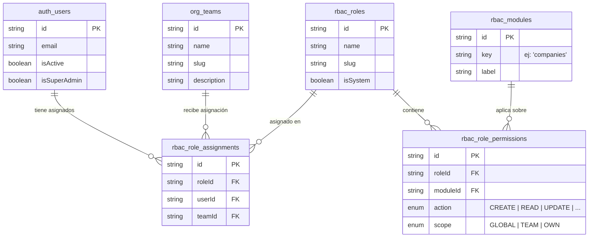
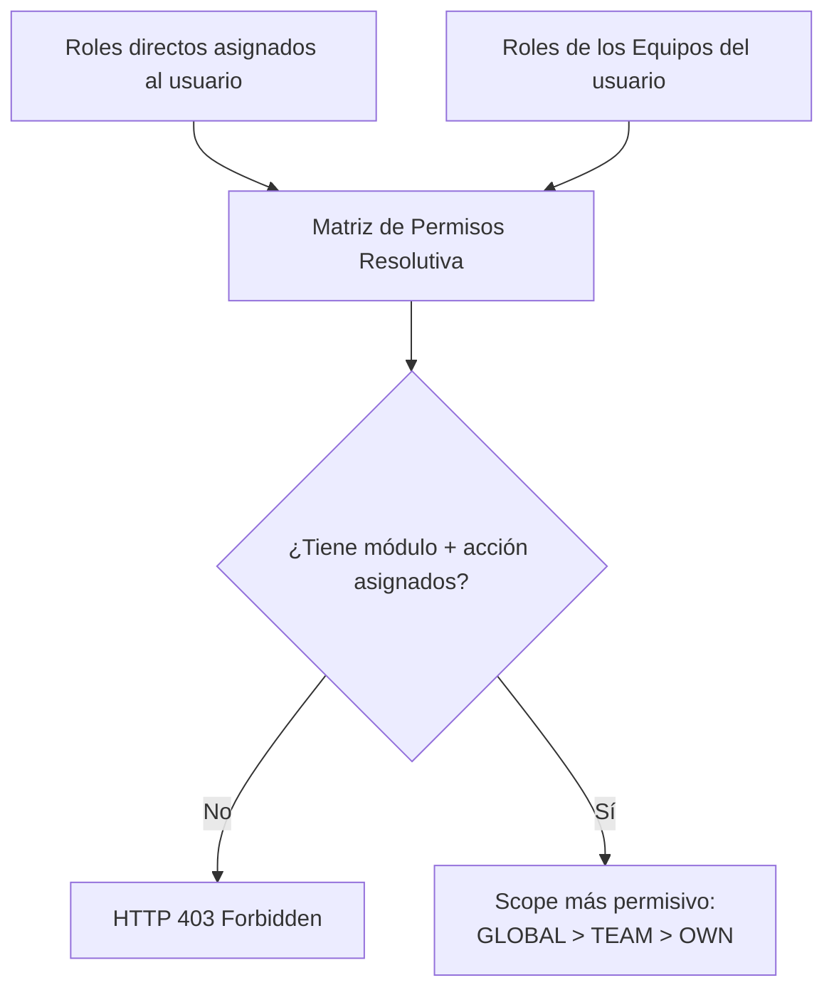
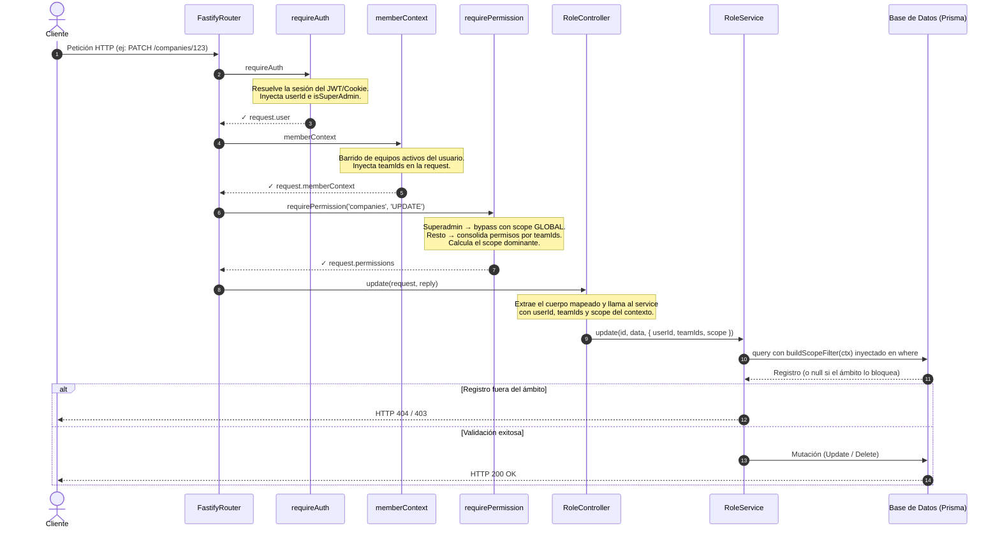

# Guía del Sistema de Roles y Permisos (RBAC)

Este documento describe el diseño y operativa del sistema de **Control de Acceso Basado en Roles (RBAC)** Los equipos son la unidad primaria de agrupación de usuarios y asignación de alcances.

---

## 1. Conceptos Fundamentales

### Principios de Diseño

- **Team (Equipo)**: Contenedor principal de permisos y colaboración. Los roles no se vinculan directamente a personas individuales, sino a equipos.
- **Usuario**: Puede pertenecer a uno o múltiples equipos simultáneamente. Hereda automáticamente la suma de todos los permisos de los equipos a los que pertenece.
- **Superadmin**: Atributo booleano en la cuenta del usuario que otorga acceso total e irrestricto a toda la infraestructura. Ignora cualquier validación de roles de equipo y tiene capacidades plenas sobre todas las tablas del sistema.

### Entidades del Modelo



---

## 2. Elementos Clave del Control de Acceso

Para autorizar una petición, el backend evalúa tres variables críticas:

### Recurso (`Module`)

La entidad o módulo de la aplicación sobre la cual se interactúa (ej: `companies`, `teams`, `documents`).

### Acción (`PermissionAction`)

| Acción     | Descripción                                                              |
| ---------- | ------------------------------------------------------------------------ |
| `CREATE`   | Crear nuevos registros en la base de datos.                              |
| `READ`     | Visualizar, listar, buscar o consultar información.                      |
| `UPDATE`   | Modificar datos de elementos preexistentes.                              |
| `DELETE`   | Eliminar elementos (borrado lógico o papelera).                          |
| `RESTORE`  | Recuperar registros desde el estado de papelera.                         |
| `EXPORT`   | Descargar o exportar datos en formatos externos (CSV/XLSX).              |
| `IMPORT`   | Ingesta masiva de datos hacia el módulo.                                 |
| `SETTINGS` | Modificar parámetros internos o configuraciones específicas del recurso. |

### Ámbito (`PermissionScope`)

Determina la barrera de visibilidad que se aplica automáticamente sobre las consultas, ordenados de mayor a menor jerarquía:

| Ámbito      | Descripción        | Criterio de filtro aplicado                                                                                                                            |
| ----------- | ------------------ | ------------------------------------------------------------------------------------------------------------------------------------------------------ |
| 👑 `GLOBAL` | Acceso irrestricto | No inyecta condiciones adicionales en las consultas.                                                                                                   |
| 👥 `TEAM`   | Acceso de equipo   | El registro debe coincidir en `ownerTeamId` con alguno de los `teamIds` del usuario, **o** su `owner`/`creator` debe pertenecer a uno de esos equipos. |
| 👤 `OWN`    | Acceso personal    | El registro debe coincidir estrictamente con el `ownerId` o `createdBy` del usuario.                                                                   |

---

## 3. Implementación: `rbac-filter.ts`

El archivo `src/utils/rbac-filter.ts` expone dos funciones que materializan la lógica de ámbito en capas distintas del pipeline.

### `buildScopeFilter(ctx: ScopeContext)`

Construye el objeto `where` de Prisma para inyectar directamente en consultas de base de datos. Se ejecuta **antes** de que los datos lleguen a la aplicación.

```ts
// src/utils/rbac-filter.ts
import type { ScopeContext } from '@/types/base.types.js';

export function buildScopeFilter(ctx: ScopeContext): Record<string, any> {
  switch (ctx.scope) {
    case 'GLOBAL':
      return {};

    case 'OWN':
      return {
        OR: [{ ownerId: ctx.userId }, { createdBy: ctx.userId }],
      };

    case 'TEAM': {
      const teamsFilter = ctx.teamIds && ctx.teamIds.length > 0 ? { in: ctx.teamIds } : { in: [] };

      return {
        OR: [
          // A. El registro tiene asignado el equipo explícitamente
          { ownerTeamId: teamsFilter },

          // B. El dueño del registro pertenece a uno de los equipos del usuario
          {
            owner: {
              teamMember: { some: { teamId: teamsFilter } },
            },
          },

          // C. El creador del registro pertenece a uno de los equipos del usuario
          {
            creator: {
              teamMember: { some: { teamId: teamsFilter } },
            },
          },
        ],
      };
    }

    default:
      return {};
  }
}
```

**Cuándo usarla:** En cualquier `findMany`, `findFirst` o subquery donde el scope deba filtrarse a nivel de base de datos. El `where` resultante se combina con los filtros propios del servicio.

**Casos de borde importantes para `TEAM`:**

- Si `ctx.teamIds` es un array vacío, el filtro `{ in: [] }` garantiza que no se devuelva ningún registro (comportamiento correcto: el usuario no pertenece a ningún equipo).
- Las ramas B y C requieren que el modelo de Prisma incluya las relaciones `owner.teamMember` y `creator.teamMember`. Si no están presentes en el schema, esas ramas devuelven vacío sin errores en runtime.

---

### `checkRecordOwnership(record, ctx, userTeamIds)`

Valida de forma **síncrona y en memoria** si un registro ya cargado cumple con el scope. Útil para operaciones unitarias post-`findUnique` o para validar mutaciones puntuales sin lanzar una segunda consulta.

```ts
export function checkRecordOwnership(
  record: any,
  ctx: ScopeContext,
  userTeamIds: string[],
): boolean {
  if (!record) return false;

  switch (ctx.scope) {
    case 'GLOBAL':
      return true;

    case 'OWN':
      return record.ownerId === ctx.userId || record.createdBy === ctx.userId;

    case 'TEAM':
      if (record.ownerTeamId && userTeamIds.includes(record.ownerTeamId)) {
        return true;
      }
      // Para verificar owner.teamMember o creator.teamMember en memoria,
      // el registro debe haber sido cargado con esos includes en la consulta previa.
      // Si no se incluyeron, usa buildScopeFilter directamente en el 'where' de la mutación.
      return false;
  }
}
```

**Cuándo usarla:** Tras un `findUnique` cuando necesitas confirmar pertenencia antes de ejecutar una mutación. Si el `record` no incluye las relaciones `owner.teamMember` o `creator.teamMember`, la cobertura de `TEAM` se limita a `ownerTeamId`; en ese caso es más seguro delegar la validación a `buildScopeFilter` en el `where` de la propia mutación.

---

## 4. Jerarquía de Servicios

Las operaciones del backend se dividen en tres bloques:

1. **Operaciones del Núcleo**: Carga estática de módulos y acciones del sistema. Globales y transversales.
2. **Operaciones con Auditoría**: Entidades estructurales (Roles, Equipos). No pertenecen a un usuario en particular; registran `createdBy` y `updatedBy` para trazabilidad.
3. **Operaciones de Negocio Protegidas**: Modelos de negocio (Empresas, Facturas, Documentos). Almacenan obligatoriamente `ownerId` y `ownerTeamId` en cada inserción para que los filtros de ámbito funcionen correctamente.

---

## 5. Asignación y Flujo de Roles

### Gestión por Equipos

Es el flujo estándar de la plataforma:

- **Equipo "Administradores"** → Rol `Admin` con ámbito `GLOBAL`
- **Equipo "Ventas"** → Rol `Editor` con ámbito `TEAM` en módulos de negocio
- **Equipo "Soporte Técnico"** → Rol `Viewer` con ámbito `OWN` de lectura y edición

Cuando un usuario es añadido a un equipo, sus tokens y contextos de sesión heredan de inmediato los privilegios de ese grupo.

---

## 6. Herencia de Permisos en Runtime

Cuando un usuario realiza una petición, el middleware consolida todas sus asignaciones activas en una **Matriz Resolutiva**:



Si dos equipos distintos otorgan permisos solapados para el mismo recurso, el evaluador **siempre prioriza la política más permisiva**.

---

## 7. Flujo Funcional de una Petición



---

## 8. Matrices de Roles Predeterminadas

### Rol: Administrador (`Admin`)

Gobernanza completa sobre todas las configuraciones del sistema y el negocio. Scope `GLOBAL` en todos los módulos.

| Módulo        | READ | CREATE | UPDATE | DELETE | RESTORE | EXPORT | IMPORT | SETTINGS |
| ------------- | :--: | :----: | :----: | :----: | :-----: | :----: | :----: | :------: |
| **users**     |  ✔   |   ✔    |   ✔    |   ✔    |    ✔    |   ✔    |   ✔    |    ✔     |
| **teams**     |  ✔   |   ✔    |   ✔    |   ✔    |    ✔    |   ✔    |   ✔    |    ✔     |
| **roles**     |  ✔   |   ✔    |   ✔    |   ✔    |    ✔    |   ✔    |   ✔    |    ✔     |
| **companies** |  ✔   |   ✔    |   ✔    |   ✔    |    ✔    |   ✔    |   ✔    |    ✔     |
| **documents** |  ✔   |   ✔    |   ✔    |   ✔    |    ✔    |   ✔    |   ✔    |    ✔     |

### Rol: Editor (`Editor`)

Operativa diaria de negocio a nivel de equipo. Sin acceso a configuración de roles o sistema. Scope `TEAM` en módulos de negocio.

| Módulo        | READ | CREATE | UPDATE | DELETE | RESTORE | EXPORT | IMPORT | SETTINGS |
| ------------- | :--: | :----: | :----: | :----: | :-----: | :----: | :----: | :------: |
| **users**     |  ✔   |   –    |   –    |   –    |    –    |   –    |   –    |    –     |
| **teams**     |  ✔   |   –    |   –    |   –    |    –    |   –    |   –    |    –     |
| **roles**     |  ✔   |   –    |   –    |   –    |    –    |   –    |   –    |    –     |
| **companies** |  ✔   |   ✔    |   ✔    |   ✔    |    –    |   –    |   –    |    –     |
| **documents** |  ✔   |   ✔    |   ✔    |   ✔    |    –    |   –    |   –    |    –     |

### Rol: Lector (`Viewer`)

Consumo de información de negocio dentro de sus equipos. Sin acceso a módulos críticos del sistema. Scope `OWN` o `TEAM` en módulos de negocio según configuración.

| Módulo        | READ | CREATE | UPDATE | DELETE | RESTORE | EXPORT | IMPORT | SETTINGS |
| ------------- | :--: | :----: | :----: | :----: | :-----: | :----: | :----: | :------: |
| **users**     |  –   |   –    |   –    |   –    |    –    |   –    |   –    |    –     |
| **teams**     |  –   |   –    |   –    |   –    |    –    |   –    |   –    |    –     |
| **roles**     |  –   |   –    |   –    |   –    |    –    |   –    |   –    |    –     |
| **companies** |  ✔   |   –    |   –    |   –    |    –    |   –    |   –    |    –     |
| **documents** |  ✔   |   –    |   –    |   –    |    –    |   –    |   –    |    –     |
